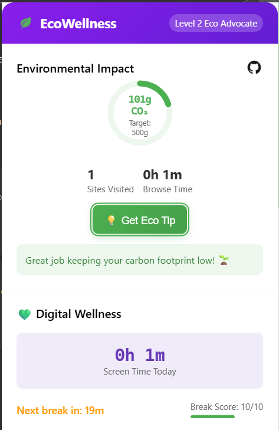
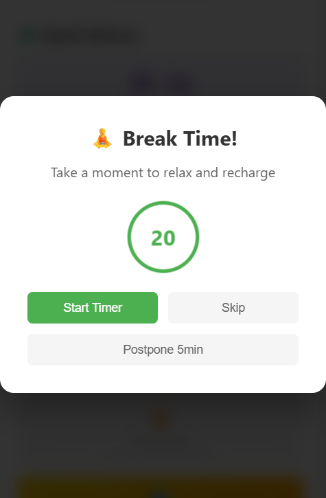
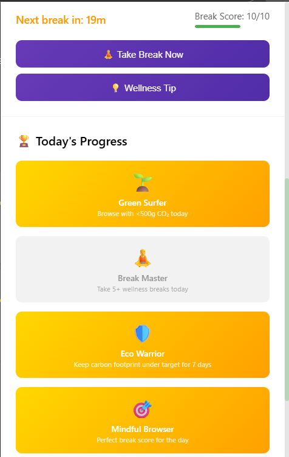
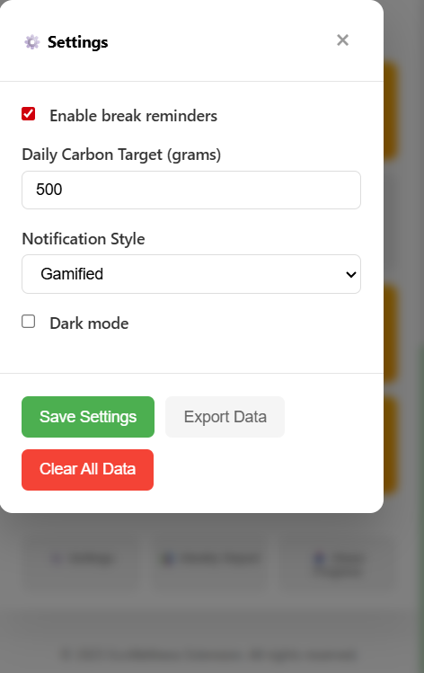

# EcoWellness Chrome Extension

EcoWellness is a lightweight Chrome extension that helps users track their digital carbon footprint and encourages healthier browsing habits through real-time monitoring and wellness reminders.

## What It Does

Tracks your environmental digital impact while promoting better screen time habits. Provides clear feedback on carbon emissions and nudges to take wellness breaks.

## Features

- Real-time carbon footprint tracking
- Digital wellness monitoring with break alerts
- Achievement badges for sustainable goals
- Dark mode support
- Weekly progress reports
- Easy sharing of progress

## Installation

1. Clone the repo
2. Open Chrome and navigate to `chrome://extensions/`
3. Enable Developer mode (toggle top right)
4. Click "Load unpacked" and select the cloned folder
5. Extension icon appears in your toolbar

## Usage

- The extension runs automatically after installation.
- Click the icon to open the dashboard.
- Set daily carbon target in settings.
- Enable wellness reminders for break notifications.

## Use Cases

**Environmental Awareness:** Monitor your daily carbon footprint and receive gentle alerts for high-impact browsing.  
**Digital Wellness:** Follow ergonomic recommendations like the 20-20-20 rule with timely reminders.  
**Personal Analytics:** Export and share your progress to stay motivated.

## Screenshots









## Repository Structure

This is the folder layout for the EcoWellness Chrome extension:

```ECOWELLNESS/               
├─ assets/
│  └─ icon/
│     └─ cursor.png           # Custom icon files
├─ background/
│  └─ service-worker.js       # Background processes
├─ content/
│  ├─ content-script.js       # Scripts injected into webpages
│  └─ overlay.js              # Overlay logic
├─ popup/
│  ├─ components/
│  │  └─ wellness-timer.js    # Wellness timer module
│  ├─ index.html              # Popup window HTML
│  ├─ popup.js                # Popup logic
│  └─ styles.css              # Popup styling
├─ utils/
│  ├─ carbon-calculator.js    # Carbon emission calculations
│  └─ wellness-tracker.js     # Digital wellness logic
├─ LICENSE                    # Licensing information
├─ manifest.json              # Chrome extension manifest
└─ README.md                  # Documentation
```

## Development & Running

- Clone the repo and load it unpacked in Chrome extensions for testing.
- Use Chrome DevTools for debugging popup and background scripts.
- Technologies used: HTML5, CSS3, ES6 JavaScript, Chrome Extension APIs.

## Troubleshooting

- Ensure Chrome version 88+ and Developer mode enabled.
- Verify notifications permission for wellness alerts.
- Restart browser or reload extension if tracking is inaccurate.

## Contributing

1. Fork the repo.
2. Make a feature branch.
3. Commit your changes.
4. Create a pull request.

## License

MIT License. See LICENSE file for details.

---

Helping users build sustainable, mindful digital habits with every click.
